# SmartBooking

Aplikacja React + Vite do rezerwacji sal. Projekt zawiera routing, logowanie Firebase Authentication, chronione trasy, lokalny stan rezerwacji i powiadomień, integrację Google Analytics, integrację Hotjar oraz konfigurację deployu przez Firebase Hosting.

## Technologie

- React 18
- Vite
- React Router
- Firebase Authentication
- Firebase Hosting
- Google Analytics 4 przez `react-ga4`
- Hotjar przez `@hotjar/browser`
- CSS w `src/styles/global.css`

## Zawartość projektu

- `src/App.jsx` - główny komponent aplikacji, routing, inicjalizacja Google Analytics i Hotjar
- `src/main.jsx` - wejście aplikacji oraz providery kontekstów
- `src/pages/` - pełne widoki aplikacji powiązane z trasami
- `src/components/` - komponenty wielokrotnego użycia
- `src/context/ReservationContext.jsx` - stan rezerwacji zapisywany w `localStorage`
- `src/context/NotificationContext.jsx` - stan powiadomień zapisywany w `localStorage`
- `src/firebaseAuth.js` - logowanie, rejestracja, wylogowanie i obserwacja stanu użytkownika
- `src/firebaseConfig.js` - konfiguracja Firebase przez zmienne środowiskowe
- `src/styles/global.css` - style i responsywność aplikacji
- `firebase.json` - konfiguracja Firebase Hosting
- `.firebaserc` - domyślny projekt Firebase

## Struktura widoków

- `/login` - logowanie i rejestracja
- `/` - strona główna / lista sal
- `/entries` - formularz rezerwacji sali
- `/reports` - lista rezerwacji
- `/edit/:id` - edycja rezerwacji
- `/history` - historia rezerwacji
- `/notifications` - powiadomienia
- `/calendar` - tygodniowy kalendarz rezerwacji
- `/profile` - profil użytkownika
- `*` - strona 404 dla nieistniejących ścieżek

Większość tras jest chroniona komponentem `ProtectedRoute`. Niezalogowany użytkownik jest przekierowywany na `/login`.

## Komponenty wielokrotnego użycia

- `Navbar` - główna nawigacja aplikacji
- `ProtectedRoute` - zabezpieczenie tras wymagających logowania
- `AnalyticsListener` - wysyłanie page view do Google Analytics po zmianie trasy
- `Button` - wspólny komponent przycisku
- `TextInput` - wspólne pole tekstowe z etykietą
- `FormField` - wspólna etykieta dla pól formularza, np. `input` i `select`
- `PagePanel` - wspólny panel strony z nagłówkiem
- `Card` - komponent karty

## Funkcjonalności

- Routing między ekranami bez przeładowania strony
- Fallback 404 dla nieistniejących adresów
- Logowanie i rejestracja użytkownika przez Firebase Email/Password
- Wylogowanie użytkownika
- Chronione trasy po zalogowaniu
- Lista sal z filtrowaniem
- Tworzenie rezerwacji
- Edycja rezerwacji
- Historia rezerwacji ograniczona do dat wcześniejszych niż aktualna data
- Powiadomienia po złożeniu rezerwacji
- Oznaczanie powiadomień jako przeczytane pojedynczo i grupowo
- Tygodniowy kalendarz rezerwacji z pełnym zakresem godzinowym od `0:00` do `24:00`
- Responsywny interfejs dla desktopu, tabletów i telefonów
- Google Analytics 4 z obsługą page view w React Routerze
- Hotjar inicjalizowany przy starcie aplikacji

## Konfiguracja środowiska

1. Skopiuj `.env.example` do `.env`.
2. Uzupełnij wartości Firebase, Google Analytics i Hotjar:

```env
VITE_FIREBASE_API_KEY=...
VITE_FIREBASE_AUTH_DOMAIN=...
VITE_FIREBASE_PROJECT_ID=...
VITE_FIREBASE_STORAGE_BUCKET=...
VITE_FIREBASE_MESSAGING_SENDER_ID=...
VITE_FIREBASE_APP_ID=...
VITE_FIREBASE_MEASUREMENT_ID=G-XXXXXXXXXX
VITE_GOOGLE_ANALYTICS_ID=G-XXXXXXXXXX
VITE_HOTJAR_SITE_ID=1234567
VITE_HOTJAR_VERSION=6
```

3. W Firebase Console włącz Authentication provider `Email/Password`.

## Uruchomienie lokalne

Zainstaluj zależności:

```bash
npm install
```

Uruchom tryb developerski:

```bash
npm run dev
```

Zbuduj aplikację produkcyjnie:

```bash
npm run build
```

Podejrzyj build lokalnie:

```bash
npm run preview
```

## Deploy

Projekt jest przygotowany do deployu przez Firebase Hosting.

Konfiguracja w `firebase.json` publikuje folder `dist`:

```json
{
  "hosting": {
    "public": "dist",
    "rewrites": [
      {
        "source": "**",
        "destination": "/index.html"
      }
    ]
  }
}
```

Rewrite do `index.html` jest potrzebny, żeby React Router działał po odświeżeniu podstron, np. `/calendar` albo `/notifications`.

Domyślny projekt Firebase jest ustawiony w `.firebaserc`:

```json
{
  "projects": {
    "default": "smartbooking-238e2"
  }
}
```

Deploy:

```bash
npm run build
firebase deploy --only hosting
```

Po udanym deployu Firebase zwróci publiczny adres aplikacji.

## Google Analytics

Google Analytics jest inicjalizowane w `src/App.jsx`:

```jsx
const analyticsId = import.meta.env.VITE_GOOGLE_ANALYTICS_ID;
if (analyticsId) {
  ReactGA.initialize(analyticsId);
}
```

Page view przy zmianie trasy obsługuje `src/components/AnalyticsListener.jsx`:

```jsx
ReactGA.send({
  hitType: 'pageview',
  page: location.pathname + location.search,
});
```

Dzięki temu przejścia między ekranami w React Routerze są widoczne w GA4 mimo braku pełnego przeładowania strony.

## Hotjar

Hotjar jest inicjalizowany w `src/App.jsx`:

```jsx
const hotjarSiteId = Number(import.meta.env.VITE_HOTJAR_SITE_ID);
const hotjarVersion = Number(import.meta.env.VITE_HOTJAR_VERSION) || 6;

if (hotjarSiteId) {
  Hotjar.init(hotjarSiteId, hotjarVersion);
}
```

Identyfikator `VITE_HOTJAR_SITE_ID` należy pobrać z panelu Hotjar.

## Zrzuty ekranu aplikacji

### Logowanie

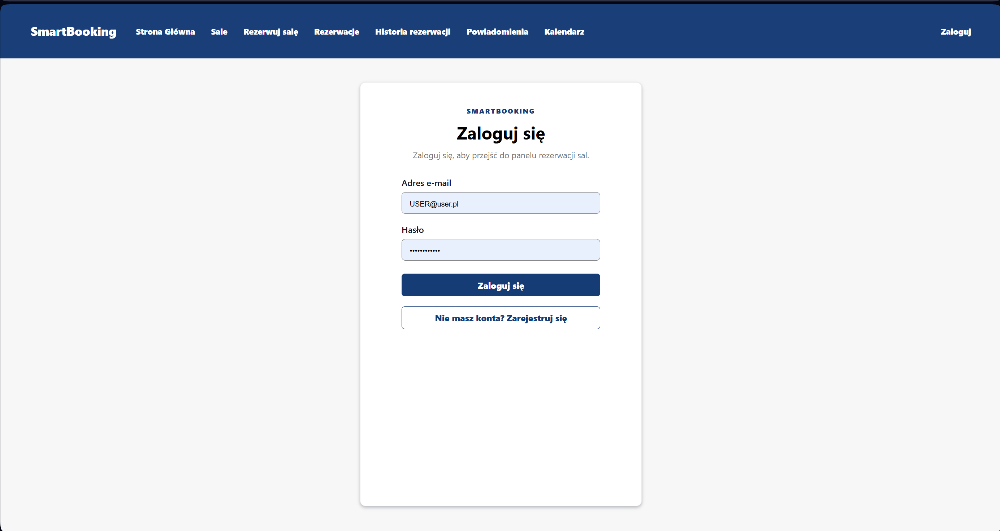

### Rejestracja

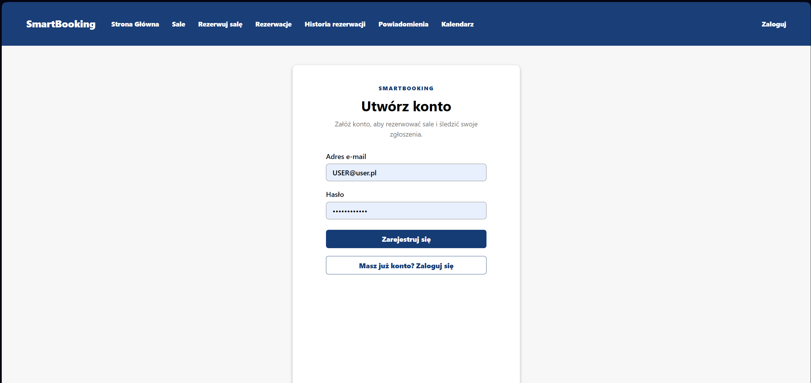

### Lista sal

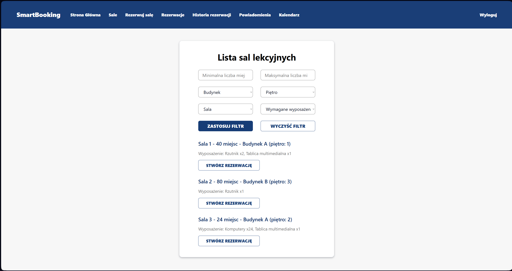

### Rezerwacja sali

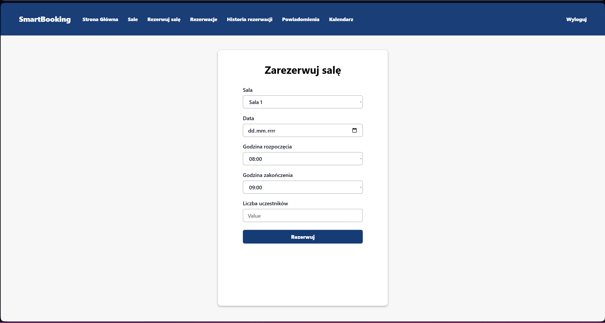

### Historia rezerwacji

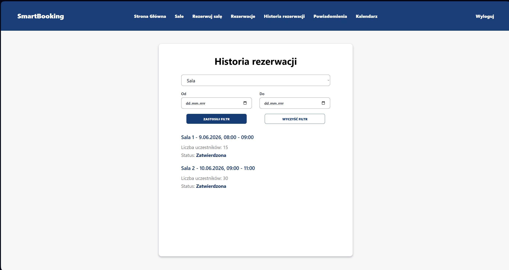

### Powiadomienia

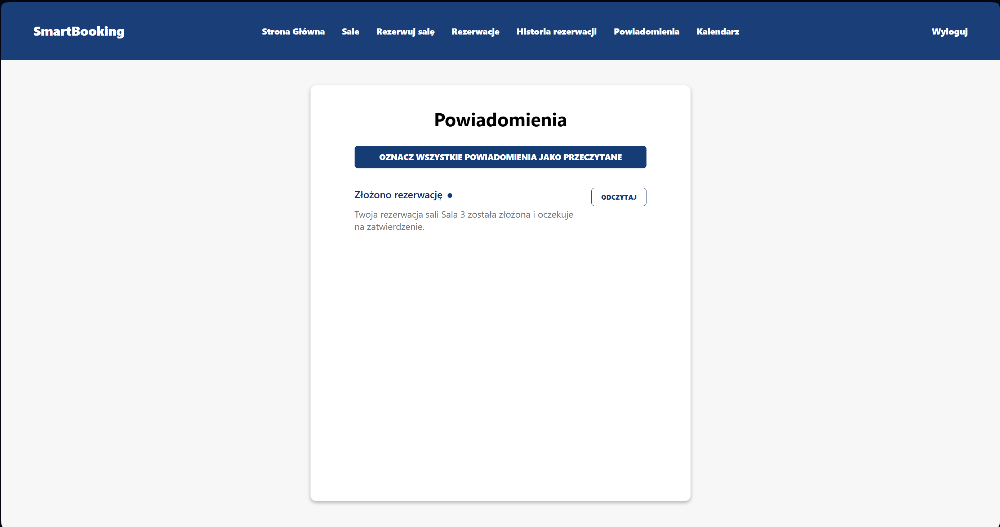

### Kalendarz

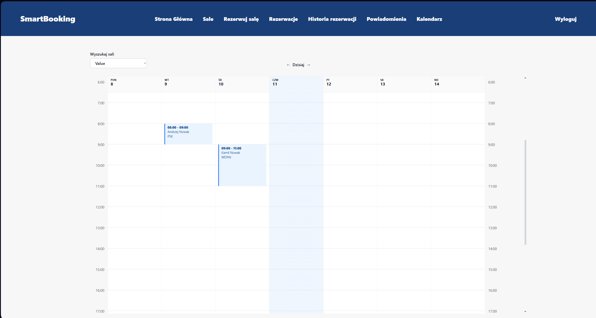

## Zrzuty ekranu Google Analytics i Hotjar

### Google Analytics
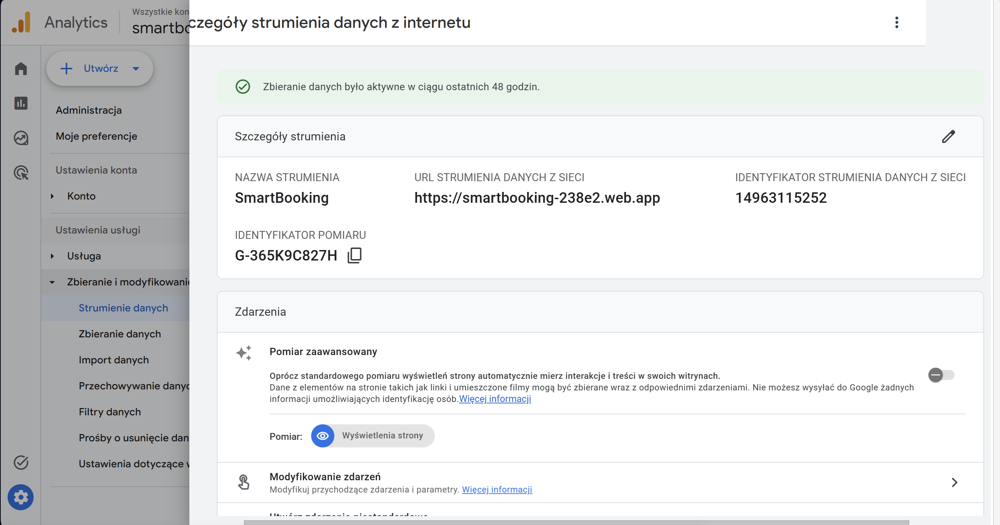

### Realtime

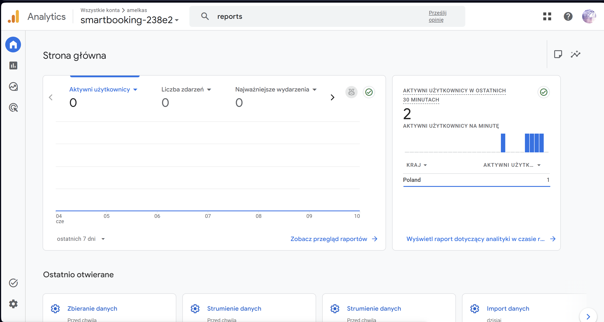

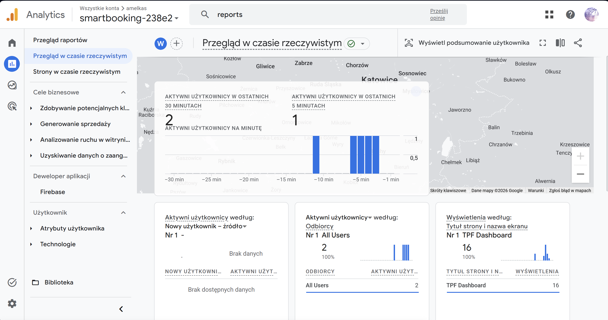

### Firebase

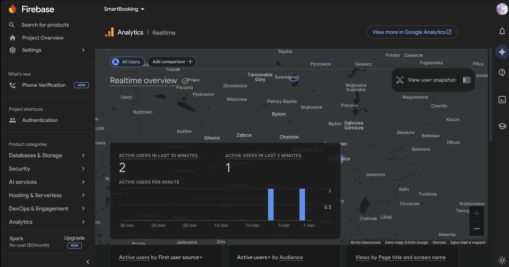

### Debug view
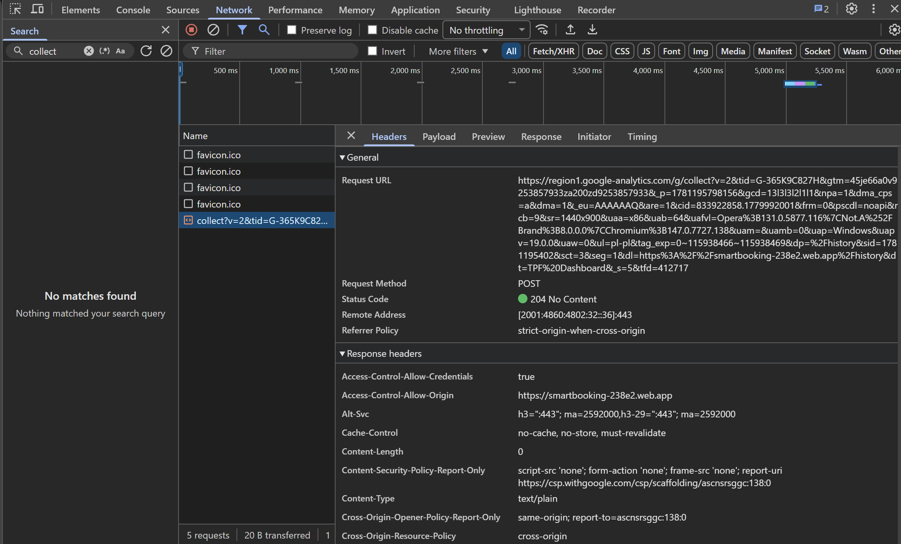


